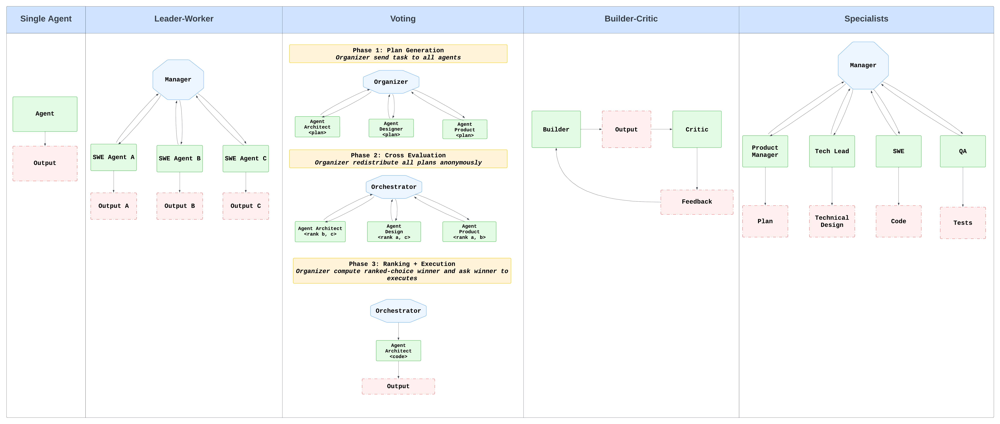

# Coordination Protocols for Multi-Agent Systems in Software Development

## Author
Phuc Duong

Advisor: Professor Timos Antonopoulos

Senior Thesis

Yale University, Department of Computer Science

## Overview

Coordinating multiple large language model (LLM) agents on software engineering tasks remains an open challenge even as single-agent systems continue to improve at code generation and debugging. Understanding how to organize multi-agent architectures can help us develop systems that can carry out more complex, multi-step software development workflows with little human oversight. In this work, we design and evaluate four distinct coordination protocols, Builder–Critic, Leader–Worker, Voting, and a role-specialized pipeline. We evaluate these systems across short-horizon tasks using HumanEval+, real-world bug fixing with SWE-bench Verified, and long-horizon end-to-end development projects. Our results show that lightweight feedback loops yield notable gains on short tasks, whereas more complex multi-agent structures introduce significant coordination overhead without improving outcomes on repository-level issues. In open-ended development projects that require extended planning, creativity, and coordination across development phases, approaches based on role differentiation show clearer advantages, yet they come at higher computational cost with increased runtime overhead.
These findings characterize the trade-offs between coordination structure, accuracy, and computational cost in multi-agent orchestration and offer guidance for designing scalable multi-agent systems for different classes of software engineering tasks. Full report [here](report.pdf).



## Setup

**Base Multi-Agent Package Requirements**
- Python 3.11.12
- claude-agent-sdk 0.1.14
- mcp 1.22.0
- rich 14.2.0
- tqdm 4.67.1

**End-To-End Project Benchmark Packages**
- scikit-learn 1.3.0
- fastapi 0.104.1
- flask 2.3.0
- numpy 1.24.0
- pandas 2.0.0

To install the dependencies, please do the following command in the root directory `multiagent-orchestration`.

```
pip install e .
pip install -r requirements.txt
```

**Environmental Variables**
Ensure you have a `.env` file with the following API keys

```bash
ANTHROPIC_API_KEY=<key>
```

## Dataset

The datasets that were used are [HumanEval+](https://huggingface.co/datasets/evalplus/humanevalplus) and [SWE-bench Verified](https://huggingface.co/datasets/princeton-nlp/SWE-bench_Verified).

For SWE-bench Verified, we ran each evaluation in a Docker image using Epoch's AI [image registry](https://github.com/epoch-research/SWE-bench?tab=readme-ov-file) for SWE-bench.


**Related Files**

- [eval_datasets](eval_datasets): All datasets used in this project.
- [generate_human_eval_tests.py](scripts/generate_human_eval_tests.py): Extracts test cases from the HumanEval+ dataset and save them as individual files for running.
- [fetch_sbv.py](scripts/fetch_sbv.py): Fetches the SWE-bench Verified dataset and randomly sample a fixed amount.
- [pull_sbv_image.sh](scripts/pull_sbv_image.sh): Pull Epoch's AI Docker image locally and verify it can be loaded using [verify_sbv_image.sh](scripts/verify_sbv_image.sh).


## Coordination Protocols

Each protocol was built using the `claude-agent-sdk` as the base framework.

**Related Files**

- [base_agents.py](agents/base_agent.py): Base agents the wraps around the Claude Agent SDK.
- [execution_log.py](agents/execution_log.py): Custom logging for the project to capture tool usage, identify which agent is communicating, and record execution statistics.
- [subagents_manager.py](orchestrators/subagents_manager.py): Logic for managing subagent lifecycle and routing communication between orchestrator and subagents.
- [orchestrators](orchestrators/): Contains the implentation for each protocol.
- [orchestrators/prompts](orchestrators/prompts): Contains the system prompts for different agent roles in each protocol and task instructions and environment descriptions for each evaluation.

## Evaluation

All evaluation code can be found in [eval](eval/).

### Human Eval

Use [generate_human_eval_tests.py](scripts/generate_human_eval_tests.py) to generate a file for the test cases for each test. 

**Generating Protocols Solution**

```bash
# example
python3 eval/human_eval/run_eval.py \
  --orchestrator single_agent \
  --dataset <path_to_human_eval_plus.jsonl> \
  --output_directory <path_to_output_directory> \
  --limit 164 \
  --model claude-haiku-4-5-20251001 \
  --max_turn 5 \
  --log_directory <path_to_log_directory> \
  --debug
```

**Running Evaluation**

This is to compare each protocol's generated solution with the test cases.

```bash
python3 eval/human_eval/run_human_eval_tests.py \
  --tests_dir <path_to_tests_directory> \
  --solutions_dir <path_to_solutions_directory> \
  --dataset <path_to_human_eval_plus.jsonl> \
  --output_file <path_to_output_results.json>
```

### SWE Bench Verified

Use [pull_sbv_image.sh](scripts/pull_sbv_image.sh) to pull the Docker images needed for running SWE-bench Verified evaluations.

**Generating Protocols Solution**

```bash
# example
python3 eval/swe_bench_verified/run_eval.py \
  --orchestrator single_agent \
  --dataset <path_to_swe_verified.json> \
  --output_directory <path_to_output_directory> \
  --max_turn 100 \
  --limit 50 \
  --model claude-haiku-4-5-20251001 \
  --log_file <path_to_log_file.json> \
  --debug \
  --resume
```

**Running Evaluation**

This runs and apply the generated patches against the SWE-bench Verified test suite in Docker containers.

```bash
python3 eval/swe_bench_verified/run_swe_bench_tests.py \
  --tests_dir <path_to_swe_verified.json> \
  --solutions_dir <path_to_solutions_directory> \
  --output_file <path_to_output_results.json>
```

### End-To-End Tasks

End-to-end tasks evaluate the protocols on full-stack or ML projects like building a finance tracker or spam classifier dashboard.

**Generating Protocols Solution**

```bash
# example
python3 eval/end_to_end/run_eval.py \
  --dataset <path_to_end_to_end_eval.json> \
  --solutions_directory <path_to_solutions_directory> \
  --template_directory <path_to_template_directory> \
  --orchestrator single_agent \
  --model claude-haiku-4-5-20251001 \
  --max_turn 100 \
  --task <task_id> \
  --log_file <path_to_log_file.json> \
  --debug
```

**Note:** The `--task_filter` parameter can be used to run specific tasks (e.g., `finance_tracker` or `spam_classifier`). Omit this parameter to run all tasks.
